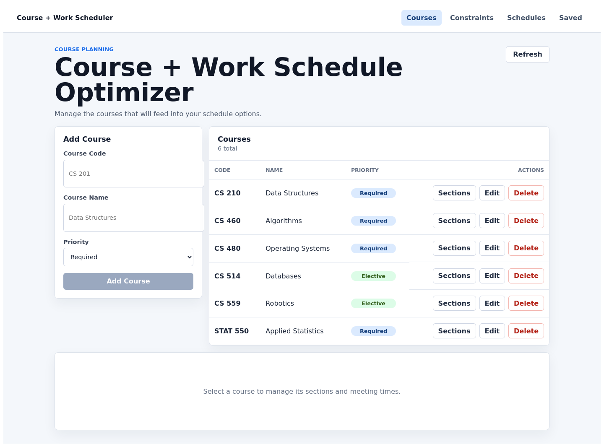
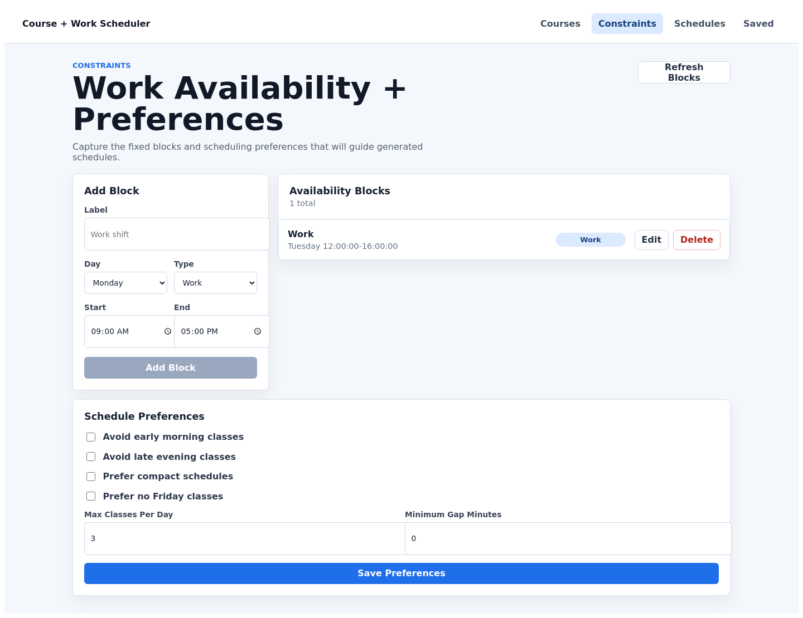
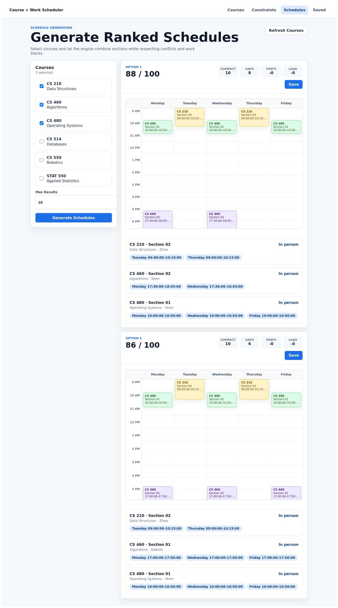
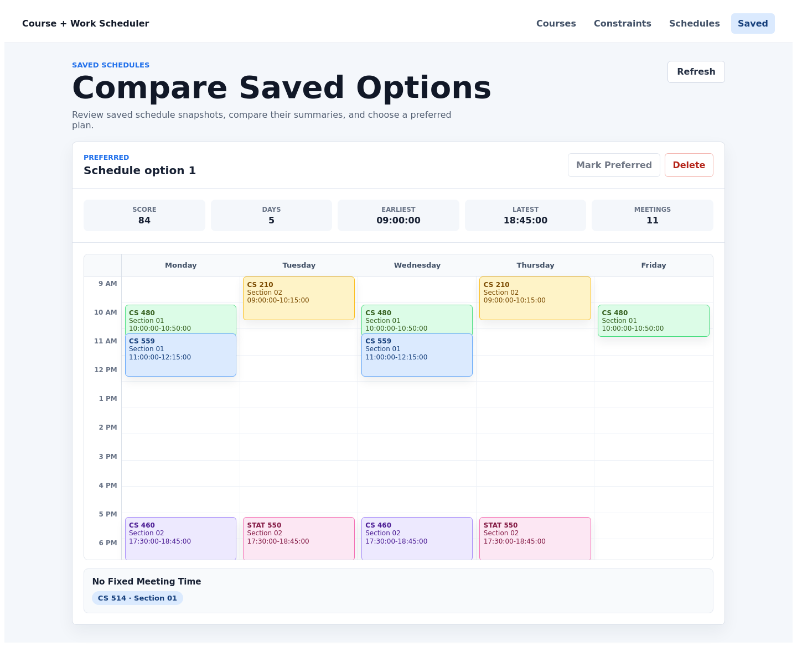

# Course + Work Schedule Optimizer

A full-stack web application that helps students generate optimized course and work schedules based on class sections, work availability, and personal preferences.

## Live Demo

Application:

```text
https://course-work-scheduler.vercel.app
```

API:

```text
https://course-work-scheduler-api.onrender.com
```

Swagger UI:

```text
https://course-work-scheduler-api.onrender.com/swagger-ui.html
```

The backend runs on Render's free tier, so the first request after a quiet
period can be slow while the service wakes up.

## Screenshots

| Course Management | Constraints + Preferences |
| --- | --- |
|  |  |

| Generated Schedules | Saved Schedule Comparison |
| --- | --- |
|  |  |

## Portfolio Highlights

This project demonstrates end-to-end full-stack development: a Vue 3 frontend, a
Spring Boot REST API, PostgreSQL persistence, Flyway migrations, Dockerized
deployment, CI checks, OpenAPI documentation, and a constraint-based schedule
generation engine.

Key technical highlights:

- Domain-oriented Spring Boot backend with controllers, services, repositories, DTOs, and validation
- Schedule generation engine that builds section combinations, rejects conflicts, and ranks valid options
- PostgreSQL schema managed with Flyway and validated by Hibernate
- Vue workflow for managing courses, constraints, generated schedules, and saved schedule comparisons
- Docker Compose local production simulation
- Hosted deployment with Vercel, Render, and Neon
- OpenAPI/Swagger documentation for API inspection
- GitHub Actions CI for backend tests, frontend tests, linting, and builds

## Tech Stack

- Vue 3
- Spring Boot
- PostgreSQL
- Flyway
- Springdoc OpenAPI
- Docker
- Vite
- Vitest
- GitHub Actions
- Vercel
- Render
- Neon
- Production Docker stack

## Project Structure

```text
course-work-scheduler/
  backend/
    src/main/java/com/scheduler/backend/
      availability/
      common/
      config/
      course/
      demo/
      preference/
      schedule/
      savedschedule/
      section/
  frontend/
    src/api/
    src/features/
  docs/
  .github/workflows/
  docker-compose.yml
```

## Architecture

The frontend is a Vue 3 single-page app organized by feature area. It calls a
Spring Boot REST API through small API modules in `frontend/src/api`.

The backend is organized by domain package. Controllers receive HTTP requests,
services hold business logic, repositories persist JPA entities, and response
objects define the API shape returned to the frontend.

PostgreSQL is the production-style database. Backend tests use H2 in PostgreSQL
compatibility mode so CI can run quickly without starting a database service.

Flyway owns schema creation and future schema changes. Hibernate validates the
database schema at startup instead of creating production tables implicitly.

## Local Development

### Start PostgreSQL

```bash
docker compose up -d
```

### Start Backend

```bash
cd backend
./mvnw spring-boot:run
```

Backend runs at:

```text
http://localhost:8080
```

Health check:

```text
http://localhost:8080/api/health
```

Actuator health check:

```text
http://localhost:8080/actuator/health
```

Interactive API documentation:

```text
http://localhost:8080/swagger-ui.html
```

OpenAPI JSON:

```text
http://localhost:8080/v3/api-docs
```

### Start Frontend

```bash
cd frontend
npm install
npm run dev
```

Frontend runs at:

```text
http://localhost:5173
```

During local development, the Vite dev server proxies `/api` requests to the
Spring Boot backend at `http://localhost:8080`.

The local backend profile enables demo seed data by default. Disable it with:

```bash
APP_DEMO_DATA_ENABLED=false ./mvnw spring-boot:run
```

## Configuration

Example environment files are included for local setup:

```text
backend/.env.example
frontend/.env.example
```

The backend also provides local defaults in `application.properties`, so Docker
Compose plus `./mvnw spring-boot:run` works without extra configuration.

The backend uses Spring profiles:

```text
local  default profile for local development
prod   production-oriented profile for Docker/deployment
```

Production settings are defined in:

```text
backend/src/main/resources/application-prod.properties
```

The root `.env.example` file documents the environment variables used by Docker
Compose.

Important deployment variables:

```text
APP_CORS_ALLOWED_ORIGINS=https://your-frontend-domain.example
APP_DEMO_DATA_ENABLED=false
SPRING_JPA_HIBERNATE_DDL_AUTO=validate
SPRING_FLYWAY_BASELINE_ON_MIGRATE=false
SPRINGDOC_API_DOCS_ENABLED=false
SPRINGDOC_SWAGGER_UI_ENABLED=false
```

## Production-like Docker Stack

To run PostgreSQL, the Spring Boot API, and the built Vue frontend together:

```bash
cp .env.example .env
docker compose up --build
```

Frontend:

```text
http://localhost:5173
```

Backend:

```text
http://localhost:8080
```

The frontend container serves the compiled Vue app with Nginx and proxies `/api`
requests to the backend container.

The Compose stack uses Flyway migrations to initialize a fresh local demo
database, then Hibernate validates the schema. Local Docker runs baseline
existing databases by default so earlier development volumes do not block
startup.

Demo seed data is enabled in the Docker stack by default. To start with an empty
database, set this in `.env`:

```text
APP_DEMO_DATA_ENABLED=false
```

## Deployment

Deployment planning and environment variables are documented in:

```text
docs/deployment.md
```

The recommended hosted portfolio stack is documented in:

```text
docs/deployment-render-neon-vercel.md
```

For hosted portfolio demos, deploy the database first, then the backend, then
the frontend. Set the frontend's `VITE_API_BASE_URL` to the deployed backend
origin unless both services share the same reverse proxy.

Suggested presentation flow:

```text
docs/demo-script.md
```

Database migration details:

```text
docs/database.md
```

API documentation details:

```text
docs/api.md
```

## Tests

### Backend

```bash
cd backend
./mvnw test
```

Backend tests use an in-memory H2 database so they can run without starting
PostgreSQL.

### Frontend

```bash
cd frontend
npm test
npm run build
```

### CI

GitHub Actions runs backend tests, frontend linting, frontend unit tests, and the
frontend production build on pull requests and pushes to `develop` or `main`.

## Current Features

- Spring Boot backend setup
- Vue frontend setup
- PostgreSQL database setup
- Health check REST endpoint
- Actuator health/info endpoints
- Course CRUD REST API
- Course management UI
- Section and meeting-time REST API
- Section management UI
- Work availability and constraints REST API
- Schedule preference management UI
- Constraint-based schedule generation API
- Ranked schedule generation UI
- Schedule scoring
- Weekly calendar visualization for generated schedules
- Saved schedule snapshots
- Saved schedule comparison UI
- Basic backend validation and error responses
- Local frontend `/api` proxy setup
- GitHub Actions CI workflow
- Dockerized backend and frontend services
- Environment-driven CORS configuration
- Demo seed data for portfolio walkthroughs
- Deployment and demo documentation
- Flyway-managed database migrations
- Interactive OpenAPI documentation
- Hosted demo on Vercel, Render, and Neon
- README screenshots for portfolio review

## What This Demonstrates

- Full-stack feature delivery across Vue, Spring Boot, and PostgreSQL
- Domain-oriented backend design with controllers, services, repositories, and DTOs
- Constraint-based schedule generation and scoring
- Calendar-based frontend visualization
- Saved schedule comparison workflow
- Automated pull request checks with GitHub Actions
- Docker-based local production simulation
- Deployment-aware configuration using Spring profiles and environment variables
- Production-safe schema management with Flyway migrations
- API contract documentation with OpenAPI and Swagger UI

## Planned Features

- Authentication and multi-user accounts
